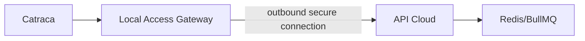

# Gateway local de controle de acesso

## Objetivo

Catracas e dispositivos físicos serão conectados por um gateway local instalado na unidade. O gateway fará conexão de saída segura com a nuvem para evitar exposição direta da rede local.

## Requisitos

- Funcionamento parcialmente offline.
- Sincronização de regras de acesso autorizadas.
- Registro local de eventos durante indisponibilidade.
- Reenvio idempotente quando a conexão retornar.
- Adapter por fabricante de catraca.

## Biometria

Dados biométricos não devem ser armazenados centralmente sem necessidade comprovada. Qualquer uso precisa de avaliação jurídica, minimização de dados, base legal e decisão arquitetural própria.
