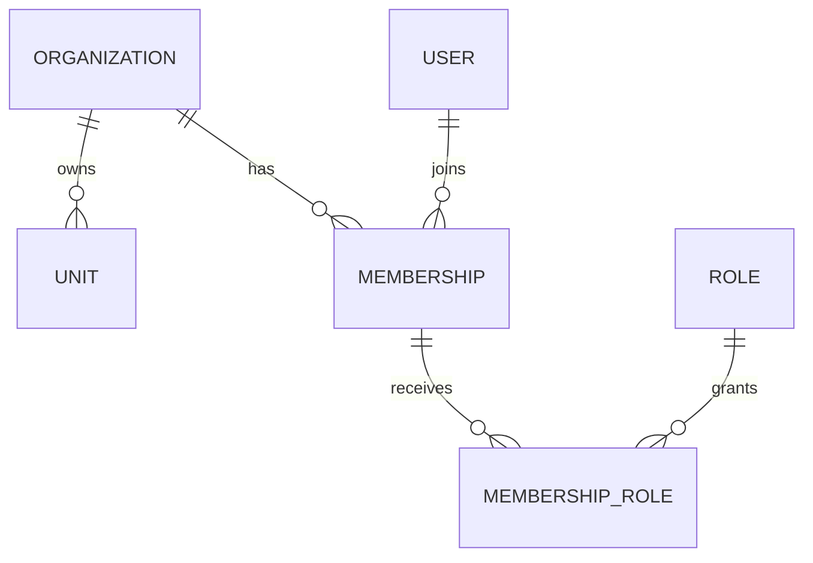

# Multi-tenancy

## Modelo

`Organization` e o tenant principal. Toda tabela de negocio deve conter `organizationId` quando o dado pertencer a uma organizacao. `Unit` sempre pertence a uma `Organization`.

## Integridade no banco

O schema adiciona constraints para impedir combinacoes cross-tenant em pontos criticos:

- `MembershipRole.organizationId` deve bater com `Membership.organizationId`.
- `MembershipRole.organizationId` deve bater com `Role.organizationId`.
- `MembershipRole.unitId`, quando existir, deve apontar para `Unit` da mesma organizacao.
- `StudentUnit` deve bater `Student.organizationId` e `Unit.organizationId`.
- `AuditLog.unitId`, quando existir, deve apontar para `Unit` da mesma organizacao.
- Assinaturas efetivas (`TRIALING` ou `ACTIVE`) nao podem ter periodos sobrepostos por organizacao.

Essas constraints nao substituem autorizacao em codigo; elas reduzem o blast radius de bugs.

## Unidades

Dados por unidade devem conter `unitId` quando aplicavel. O acesso a uma unidade deve sempre validar se a unidade pertence a organizacao do contexto.

## Memberships

Usuarios podem participar de multiplas organizacoes por memberships. Uma membership pode ter papeis de organizacao e papeis com escopo de unidade.

## Alunos

`Student` pertence a `Organization`. Vinculos com unidades usam `StudentUnit`, com foreign keys compostas para impedir que um aluno de uma organizacao seja associado a uma unidade de outra organizacao.

## Protecao contra acesso cruzado

Consultas devem filtrar por `organizationId`. Identificadores globais como UUID nao sao suficientes para autorizar acesso. Testes de integracao devem cobrir isolamento entre organizacoes.

## RLS

Row Level Security ainda nao esta ativa. A proposta esta em `docs/decisions/ADR-009-row-level-security.md` e deve ser validada antes de producao com alto risco de acesso direto ao banco.
