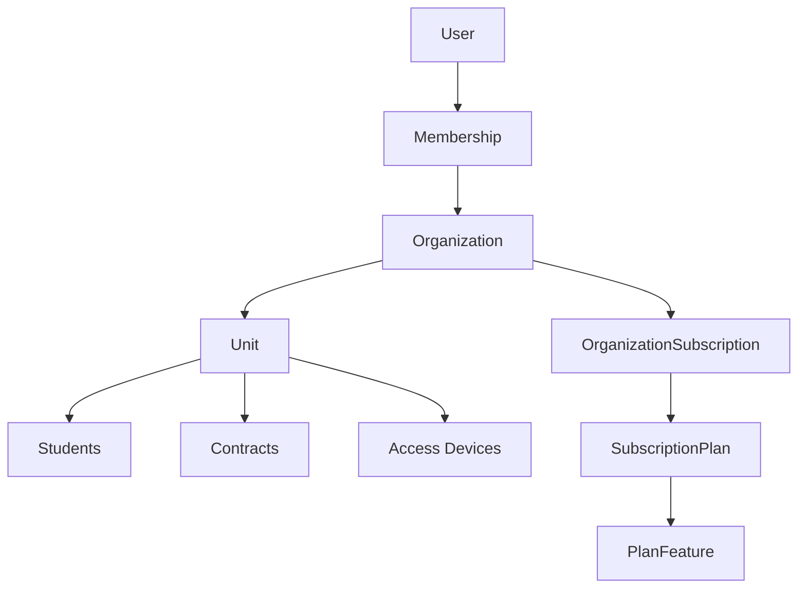

# Visao geral do sistema

## Decisao central

A plataforma e um monolito modular TypeScript. Nao serao criados tres sistemas separados para Personal, Academia e Redes. O mesmo nucleo multi-tenant atende todos os planos com funcionalidades liberadas por entitlements.

## Componentes

- `apps/admin-web`: painel administrativo em Next.js.
- `apps/api`: API NestJS com Fastify.
- `apps/workers`: processos de fila.
- `apps/student-app`: espaco reservado para experiencia dos alunos.
- `apps/access-gateway`: espaco reservado para gateway local de catracas.
- `packages/database`: Prisma schema e client.
- `packages/auth`: contrato e adapter temporario de autenticacao.
- `packages/permissions`: matriz e utilitarios de autorizacao.
- `packages/contracts`: resolucao de funcionalidades por plano.
- `packages/config`: validacao centralizada de ambiente.
- `packages/observability`: correlation ID e sanitizacao de logs.

## Fronteiras

Controllers nao executam regra de negocio. Casos de uso e services coordenam regras, repositorios e transacoes. Modulos devem expor contratos internos em vez de consultar tabelas de outros modulos diretamente.

## Estado da fundacao

- Autenticacao temporaria segura para desenvolvimento/testes.
- Cadastro com Supabase e onboarding guiado de organizacao protegidos por feature flag, fechada por
  padrao e proibida em producao nesta versao.
- Autorizacao por membership, role, permissao e escopo de unidade.
- Ciclo de vida explicito da organizacao: `ONBOARDING`, `ACTIVE` e `SUSPENDED`.
- Entitlements por plano no banco.
- Constraints de isolamento multi-tenant em tabelas criticas.
- Testes unitarios sem infraestrutura e integracao PostgreSQL separada.
- Modelo inicial de alunos decidido por ADR-011.
- Bootstrap transacional da organizacao provisoria, unidade principal, owner e permissoes padrao,
  com retomada e concorrencia otimista conforme ADR-015.
